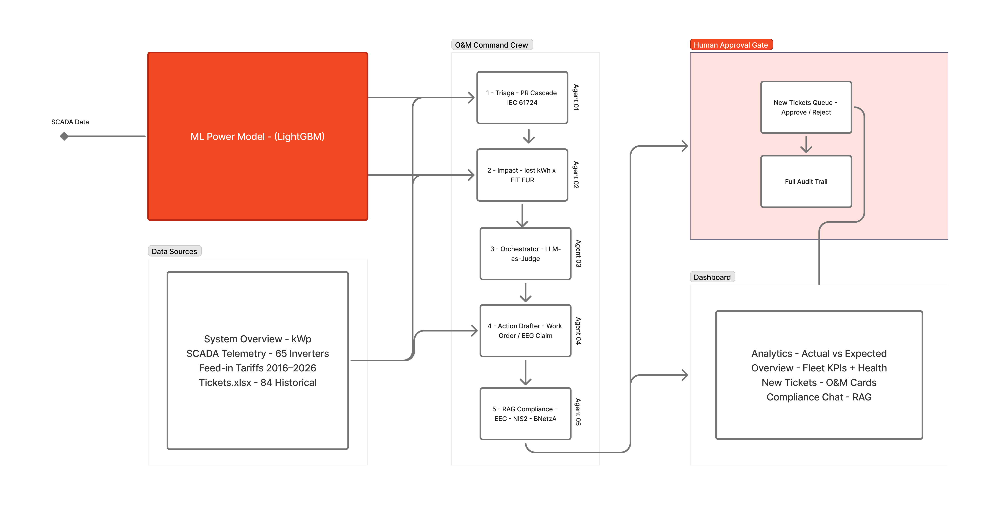

# Enerparc Pulse

**AI-powered O&M command crew for utility-scale solar.** SCADA telemetry → ML performance-ratio baseline → multi-stage fault detection → EUR impact pricing → LLM-as-judge routing → human-approved action drafts, grounded in EU/DE energy regulation.

Built for the **Energy Hack Munich 2026** (Enerparc Open Track).

> ⚖️ **Advisory only: never autonomous control.** Every outbound action stops at a human-approval gate. This is a deliberate design choice to stay out of EU AI Act high-risk classification.


---

## Architecture



> Full interactive diagram: [FigJam board](https://www.figma.com/board/Q1kWJFCyBzTyvxLqnjrg0z/beyondWatt-%C3%97-Enerparc-%E2%80%94-System-Architecture)

---

## About

Utility-scale solar O&M teams drown in raw SCADA. A 65-inverter plant throws thousands of signals a day, and the hard part isn't *seeing* a dip; it's knowing **why**. Is an inverter genuinely faulty, or was it curtailed by the grid operator (which pays compensation, not a truck roll)? Misreading that one distinction wastes field crews on non-faults while real defects (string failures, soiling, AC-side degradation) quietly bleed revenue for weeks. And every response has to respect a thick layer of EU/DE regulation (EEG §15, Redispatch 2.0, §14a, IEC 61724, NIS2, EU AI Act).

**Enerparc Pulse turns that firehose into a ranked queue of decisions a human can approve in one click.** We solve it in five moves:

1. **Learn "healthy."** An ML model predicts the Performance Ratio an inverter *should* hit for the current weather, the honest baseline, not a crude fleet average.
2. **Flag only what's real.** A PR cascade (IEC 61724) screens against that baseline with persistence + deviation filters, killing weather noise and one-off sensor blips.
3. **Name the root cause.** A cost-ordered diagnostic separates true faults (string out, soiling, conversion fault) from **external interventions** (curtailment, §14a dimming) that look identical on a power chart but mean the opposite for action and money.
4. **Price and route.** Each incident is costed in EUR (lost kWh × feed-in tariff) and routed by an LLM-as-judge: dispatch a crew, file a compensation claim, or just log it.
5. **Draft, cite, and stop.** It writes the work order or §15 EEG claim with the exact regulation cited, then **parks it at a human-approval gate. Nothing executes autonomously.**

The payoff: faster triage, fewer wasted truck rolls, recovered curtailment compensation, and a fully audit-trailed system that stays *advisory-only* under the EU AI Act.

---

## What it does

Enerparc Pulse watches a fleet of PV inverters and turns raw SCADA into *decisions a human can approve in one click*:

1. **Predicts the healthy-state Performance Ratio (PR)** with a LightGBM model, the baseline an inverter *should* hit given weather + time.
2. **Detects deviations** with a PR cascade (IEC 61724 pattern), then drills down to root cause.
3. **Prices the impact** in EUR (lost kWh × feed-in tariff).
4. **Routes** each incident (dispatch a truck / file a §15 EEG claim / log only) via an LLM-as-judge.
5. **Drafts the action** + a compliance citation, and parks it in an approval queue.

### The four demo scenarios

| Scenario | Signal | Outcome |
|---|---|---|
| **Blackout / outage** | long zero-output window, irradiation healthy, neighbours fine | fault → priced → work order |
| **Curtailment** | DV/EVU < 100 % | **not a fault** → no truck roll → §15 EEG claim drafted |
| **Balancing / forecast** | Chronos-Bolt 24 h day-ahead | battery charge/discharge narrative |
| **Reactive power** | cos φ < 0.90 | setpoint *recommendation*; payload generated only after human approval, never written back |

---

## The ML model: PR predictor

A **LightGBM** model deployed on Render predicts expected PR per interval from weather + time features (irradiance, module/ambient temp, hour, day-of-year, month + engineered sin/cos & interaction terms). It **never** sees `I_DC`/`U_DC`; those are reserved for Stage-2 root-cause diagnosis (no leakage).

- **Endpoint:** `POST https://plant-a-pr-api.onrender.com/predict`
- **Health:** `GET /health` · **Metrics:** `GET /metrics`
- **Trained:** Plant A 2017 (Jan–Sep) · **Validated:** held-out 2018

**2018 validation (500 sampled daytime points, 60 inverters):**

| Metric | Value | Reading |
|---|---|---|
| **MAE** | 0.049 | ~5 PR-points typical error |
| **RMSE** | 0.080 | outlier-sensitive; RMSE≈1.6×MAE → a few hard low-PR points |
| **R²** | 0.773 | 77 % of PR variance explained on a held-out *year*, across *unseen* inverters |
| **bias** | +0.008 | effectively unbiased |

The chart (Overview page → *Performance Ratio*) plots measured vs predicted PR with hover inspection. When the model can't be reached it falls back to a calibrated **physics baseline** (irr × kWp × temp-derate).

---

## Detection: PR cascade (IEC 61724)

**Stage 1: screen:** per-inverter daily PR vs the ML-predicted healthy baseline (and fleet-relative deviation), with a 3-day persistence filter and a data-derived absolute floor (~PR < 0.65–0.70).

**Stage 2: root cause** (runs only when Stage 1 fires, cheapest check first):

| Check | Verdict |
|---|---|
| DV/EVU < 100 % | **Curtailment** → §15 EEG claim, stop |
| all PRs drop together | **Plant-level / weather** |
| η = P_AC/(U_DC·I_DC) low | **AC/conversion fault** |
| I_DC step ≈ 1/n_strings, U_DC stable | **String out** |
| slow drift, temp-independent | **Soiling / degradation** |
| deficit locked to sun angle | **Shading** |
| seen in ticket history | **Repeat offender** → root-cause visit |

---

## Agents

| Agent | Role |
|---|---|
| `agents/triage.py` | PR cascade: Stage 1 screen + Stage 2 root cause |
| `agents/impact.py` | EUR pricing (lost kWh × FiT) |
| `agents/ml_api.py` | LightGBM PR client (Render) + physics fallback |
| `agents/ml.py` | local per-inverter LightGBM (offline training/eval) |
| `agents/forecast.py` | Chronos-Bolt 24 h forecast client (AWS Lambda, eu-north-1) |
| `agents/orchestrator.py` | LLM-as-judge: 2-tier incident routing |
| `agents/drafter.py` | action / claim / work-order drafts |
| `agents/rag_compliance.py` | keyword-keyed RAG over 7 EU/DE regulation chunks → citation per incident |

---

## Run it

```bash
pip install -r requirements.txt
uvicorn app.app:app --port 8080          # from repo root
```

Open **http://127.0.0.1:8080/draft**, the primary dashboard (Overview · Agents · Compliance Chat · Tickets · Approval Queue).

**It works out of the box.** The committed SCADA sample (`data/raw_data/inverters_first5_2023.csv`) and the pre-built artifacts in `out/*.json` are all the dashboard needs; no dataset setup required.

To **regenerate** those artifacts from scratch (optional, needs the full Enerparc datasets placed locally):

```bash
python pipelines/pipeline.py          # 5-inverter run → out/incidents.json, timeseries.json, ...
python pipelines/pipeline_2018.py     # 2018 validation → out/pr_validation.json (the PR chart)
python pipelines/pipeline_fault_test.py   # synthetic fault-injection eval
```

### API

`GET /api/inverters · /api/timeseries · /api/incidents · /api/tickets · /api/briefing · /api/forecast · /api/pr_validation` · `POST /api/decide` (audit → `out/audit.jsonl`) · `POST /api/chat`

---

## Repo layout

```
app/                    FastAPI server (app.py) + primary UI (dashboard.html)
agents/                 the 8 agents above
pipelines/              data pipelines (main / 2018 validation / fault test / synthetic)
eval/                   scoring (eval.py), PR chart gen, point-by-point fault-test runner
data/                   committed SCADA sample (raw_data/) + organizer xlsx (System_Overview, FiT, Tickets)
docs/                   Enerparc-task (system design) · agent · regulations-eu-de · demo-scenarios
assets/demo.gif         walkthrough recording
out/                    pre-built artifacts the dashboard serves (committed; runtime audit log git-ignored)
```

---

## Honesty notes

- **EUR figures are estimates** (physics/ML baseline, not certified meter): "estimated revenue impact".
- **A 12 MB SCADA sample + the dashboard's `out/*.json` are committed** so the demo runs standalone. The **full** organizer datasets (100s of MB, full-year/65-inverter files, validation sets) are git-ignored; you only need them to *regenerate* artifacts via the pipelines.
- **Runtime paths** in `pipelines/*.py` / `/api/tickets` assume the original hackathon folder layout for raw data + `2. Additional Data/`.
- **LLM features** (Compliance Chat, judge reasoning) call an Anthropic-backed helper and **degrade gracefully to deterministic mock/static text** when no key/module is present, so the pipelines and dashboard run offline-safe.
- The cos φ = 0.95 reactive-power recommendation is a domain rule, not from the dataset; the forecast price narrative has no live price feed behind it.
- **Hard rule:** every outbound action stops at the approval queue (EU AI Act advisory posture).

---

## Team

Built by **Nico Junkers · Pavan Kumar · Rebecca Riedmayer · Vasu Chukka** at Energy Hack Munich 2026.
